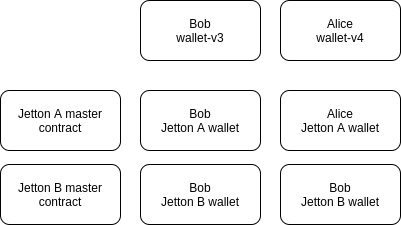

# Jettons processing
This page contains an overview and specific details that explain how to process (send and accept) distributed tokens (or how it  is called in TON - _jettons_).

It is expected, that reader is familiar with basic principles of assets processing described in [this article](/develop/dapps/asset-processing/), in particular, familiar with what is _contract_, _wallet_, _message_ and _deployment_.

# Overview
In the TON blockchain fungible tokens (FT) are commonly called Jettons. Due to the fact that the principle of sharding is applied in TON, 
the implementation of FT tokens is different from most other blockchains. 

The are formal standards which describes jettons [behavior](https://github.com/ton-blockchain/TEPs/blob/master/text/0074-jettons-standard.md) and [metadata](https://github.com/ton-blockchain/TEPs/blob/master/text/0064-token-data-standard.md).

Less formal but more focused on reasons behind sharding paradigm and Jettons architecture can be found in the 
[anatomy of jettons article](https://blog.ton.org/how-to-shard-your-ton-smart-contract-and-why-studying-the-anatomy-of-tons-jettons).)

There are also examples of jetton processing code made by community:
1. Javascript (tonweb):
  - [Accepting Jetton deposits to single HOT wallet with comments (memo)](https://github.com/toncenter/examples/blob/main/deposits-jettons-single-wallet.js)
  - [Jettons withdrawals example](https://github.com/toncenter/examples/blob/main/jettons-withdrawals.js)
2. Golang (tonutils-go):
  - [Transfer NFT & Jettons by creating a transfer message](https://github.com/tonfactory/tonsdk#transfer-nft--jettons-by-creating-a-transfer-message-from-an-owner-wallet)

Besides there is third-party open-source TON Payment Processor [bicycle](https://github.com/gobicycle/bicycle) with ability to deposit and withdraw Toncoins as well as Jettons with separate deposit address (no need for text memo) for each user.

This article organized as follows:
1. First it very briefly describes how jettons are implemented
2. Then how to get jetton data: both financial and metadata
3. Then how to interact with jettons
4. How to process jettons deposits and withdrawals offchain
5. How to process jettons deposits and withdrawals onchain
6. How to process jettons in wallets

:::info
This article describes scenarios for working with Jettons which follows standard TEP-74 standard
:::


# Jetton Architecture

A standardized token is implemented through a set of contracts:
* Jetton master smart contract
* Jetton wallet smart contracts



## Jetton master smart contract
It stores general information about the Jetton (total supply, a link or the metadata itself ...)

:::info
Anybody can create his own Jetton with arbitrary name, ticker, image etc. So, anybody can create worthless clone of valuable Jetton which will look exactly like the last. Such Jettons can be distinguished by their adddresses. To find true addresses of desired Jettons follow Jettons' official channels or websites. There are also curated lists of assets, for instance [TonKeeper ton-assets list](https://github.com/tonkeeper/ton-assets).
:::

### How to get Jetton data
To get Jetton data, one shoud use a `get_jetton_data()`  get method.

This method returns the following data:

| Name               | Type  | Description
|--------------------|-------|--------------------
| `total_supply`       | `int`  | Total number of issues jettons measured in indivisable units
| `mintable`          | `int`   | Whether new jettons can be mint or not. This value is either `0` or `-1`
| `admin_address`      | `slice` | 
| `jetton_content`     | `cell` | data in accordance to [TEP-64](https://github.com/ton-blockchain/TEPs/blob/master/text/0064-token-data-standard.md).
| `jetton_wallet_code` | `cell`  |


You can also use the method `/getTokenData` of [Toncenter API](https://toncenter.com/api/v2/) to get already decoded Jetton 
data and metadata. There are also ready methods in js' [tonweb](https://github.com/toncenter/tonweb/blob/master/src/contract/token/ft/JettonMinter.js#L85) and [ton-core/ton (js)](https://github.com/ton-core/ton/blob/master/src/jetton/JettonMaster.ts#L28), go' [tongo](https://github.com/tonkeeper/tongo/blob/master/liteapi/jetton.go#L48) and [tonutils-go](https://github.com/xssnick/tonutils-go/blob/33fd62d754d3a01329ed5c904db542ab4a11017b/ton/jetton/jetton.go#L79), python' [pytonlib](https://github.com/toncenter/pytonlib/blob/d96276ec8a46546638cb939dea23612876a62881/pytonlib/client.py#L742) and many other SDKs.

Example of using [Tonweb](https://github.com/toncenter/tonweb) to run get method and get url for 
offchain metadata:
```js
import TonWeb from "tonweb";
const tonweb = new TonWeb();
const jettonMinter = new TonWeb.token.jetton.JettonMinter(tonweb.provider, {address: "<JETTON_MASTER_ADDRESS>"});
const data = await jettonMinter.getJettonData();
console.log('Total supply:', data.totalSupply.toString());
console.log('URI to off-chain metadata:', data.jettonContentUri);
```

#### Jetton metadata
More info on parsing metadata is given [here](develop/dapps/asset-processing/metadata).

## Jetton wallet smart contract
Jetton wallet contracts are used to receive, sending and burning Jettons. Each _jetton wallet_ stores information on balance of specific user. There are individual instance of _jetton wallet_ for each jetton holder of of each Jetton.

Do not confuse the user's wallet for storing TON and interaction with blockchain
(for example v3R2 wallet, highload wallet ...) and the Jetton wallet, which is only responsible for working with 
a specific type of Jetton.

Jetton wallet are owner by smart-contracts and the Jettons are managed using internal
messages from the owner's wallet to the Jetton wallet. So, in case of Alice owning some jettons the scheme is following:
Alice own wallet (like v3r2) and Alice's wallet owns _jetton wallet_. When Alice wants to send jettons, she send external messages to her wallet (like v3R2) and, as result, Alice's wallet send internal message to _her jetton wallet_ and _jetton wallet_ sends tokens.

### How to get Jetton wallet address for a given user
To get Jetton wallet address by owner address the Jetton master contract provides 
a get method `get_wallet_address(slice owner_address)`.

To call this method, you for instance can serialize owner address to cell and use the method `/runGetMethod` of Toncenter API.
Or use ready methods in SDKs, for instance in tonweb you can do it via
```js
import TonWeb from "tonweb";
const tonweb = new TonWeb();
const jettonMinter = new TonWeb.token.jetton.JettonMinter(tonweb.provider, {address: "<JETTON_MASTER_ADDRESS>"});
const address = await jettonMinter.getJettonWalletAddress(new TonWeb.utils.Address("<OWNER_WALLET_ADDRESS>"));
// It is important to always check that wallet indeed is attributed to desired Jetton Master:
const jettonWallet = new TonWeb.token.jetton.JettonWallet(tonweb.provider, {
  address: jettonWalletAddress
});
const jettonData = await jettonWallet.getData();
if (jettonData.jettonMinterAddress.toString(false) !== new TonWeb.utils.Address(info.address).toString(false)) {
  throw new Error('jetton minter address from jetton wallet doesnt match config');
}

console.log('Jetton wallet address:', address.toString(true, true, true));
```

### How to get data for Jetton wallet

To get balance, owner and other info on given jetton wallet contract you should use get method `get_wallet_data()` on jetton wallet contract.


This method returns the following data:

| Name               | Type  |
|--------------------|-------|
| balance            | int   |
| owner              | slice |
| jetton             | slice |
| jetton_wallet_code | cell  |

You can also use the method `/getTokenData` of Toncenter API to get already decoded Jetton wallet
data, or method in your SDK, for instance in tonweb:

```js
import TonWeb from "tonweb";
const tonweb = new TonWeb();
const walletAddress = "EQBYc3DSi36qur7-DLDYd-AmRRb4-zk6VkzX0etv5Pa-Bq4Y";
const jettonWallet = new TonWeb.token.jetton.JettonWallet(tonweb.provider,{address: walletAddress});
const data = await jettonWallet.getData();
console.log('Jetton balance:', data.balance.toString());
console.log('Jetton owner address:', data.ownerAddress.toString(true, true, true));
// It is important to always check that Jetton Master indeed recognize wallet
const jettonMinter = new TonWeb.token.jetton.JettonMinter(tonweb.provider, {address: data.jettonMinterAddress.toString(false)});
const expectedJettonWalletAddress = await jettonMinter.getJettonWalletAddress(data.ownerAddress.toString(false));
if (expectedJettonWalletAddress.toString(false) !== new TonWeb.utils.Address(walletAddress).toString(false)) {
  throw new Error('jetton minter does not recognize the wallet');
}

console.log('Jetton master address:', data.jettonMinterAddress.toString(true, true, true));
```

### Jetton wallet deploy
When transferring Jettons between wallets, messages carry a certain amount of TON to pay network fees and a Jetton
wallet contract code. This means that the recipient does not need to deploy a Jetton wallet in advance to receive Jettons.
The recipient's Jetton wallet will be deployed automatically (of course, if the sender has attached enough TON).

## Jetton contracts message layouts

Communication between jetton wallets and their owners' wallets occurs through the following messages.


`Sender -> sender' jetton wallet` Transfer message body contains such data:

| Name                 | Type    |
|----------------------|---------|
| `query_id `            | uint64  |
| `amount  `             | coins   |
| `destination  `        | address |
| `response_destination` | address |
| `custom_payload  `     | cell    |
| `forward_ton_amount`   | coins   |
| `forward_payload`      | cell    |

`payee' jetton wallet -> payee` Transfer notification message body contains such data:

| Name            | Type    |
|-----------------|---------|
| query_id    `    | uint64  |
| amount   `       | coins   |
| sender  `        | address |
| forward_payload` | cell    |

`payee' jetton wallet -> Sender` Excesses message body contains such data:

| Name                 | Type           |
|----------------------|----------------|
| `query_id`             | uint64         |

A detailed description of the fields can be found in the standard [TEP-74](https://github.com/ton-blockchain/TEPs/blob/master/text/0074-jettons-standard.md).

Messages `Transfer notification` and `Excesses` are optional and depend on the amount of TONs attached to `Transfer` 
message and the value of the `forward_ton_amount` field.

The `query_id` identifier allows you to link messages `Transfer`, `Transfer notification` and `Excesses` to each other, it is recommended to always use unique query id.

### How to send Jetton transfer with comment and notification

In order to make a transfer with a notification, you need to attach a sufficient amount of TONs to the message 
being sent, set a non-zero `forward_ton_amount` value and, if necessary, attach a text comment to the `forward_payload`.
A text comment is encoded similarly to a text comment when sending a TONs.

[Fees for sending Jettons](https://docs.ton.org/develop/smart-contracts/fees#fees-for-sending-jettons)

However, the commissions depend on several factors: the code of Jetton, the need to deploy a new Jetton wallet for 
recipient. Therefore, it is recommended to attach TONs with a margin and then set your address as the `response_destination` 
to get `Excesses` message. For example, you can attach 0.05 TON to the message and set the `forward_ton_amount` value 
to 0.01 TON (this amount of TONs will be attached to the `Transfer notification` message).

[Jetton transfer with comment example for Tonweb](https://github.com/toncenter/tonweb/blob/b550969d960235314974008d2c04d3d4e5d1f546/src/test-jetton.js#L128)
where:
```js
// first 4 bytes are tag of text comment
const comment = new Uint8Array([... new Uint8Array(4), ... new TextEncoder().encode('text comment')]);

await wallet.methods.transfer({
    secretKey: keyPair.secretKey,
    toAddress: JETTON_WALLET_ADDRESS, // address of Jetton wallet of Jetton sender
    amount: TonWeb.utils.toNano('0.05'), // total amount of TONs attached to the transfer message
    seqno: seqno,
    payload: await jettonWallet.createTransferBody({
        jettonAmount: TonWeb.utils.toNano('500'), // Jetton amount (in basic indivisible units)
        toAddress: new TonWeb.utils.Address(WALLET2_ADDRESS), // recepient user's wallet address (not Jetton wallet)
        forwardAmount: TonWeb.utils.toNano('0.01'), // some amount of TONs to invoke Transfer notification message
        forwardPayload: comment, // text comment for Transfer notification message
        responseAddress: walletAddress // return the TONs after deducting commissions back to the sender's wallet address
    }),
    sendMode: 3,
}).send()
```

## Jetton off-chain processing
Several scenarios for accepting Jettons are possible. You can accept Jettons on one centralized hot wallet,
or create a separate address for each user and receive Jettons on it.

To process Jettons, unlike TON processing, you will need not only the hot wallet (v3R2, highload...), but also a 
Jetton wallet/wallets. Hot wallet deployment is described in the [Deploying wallet](/develop/dapps/asset-processing/#deploying-wallet). 
Deployment of Jetton wallets according to the [Jetton wallet deploy](#Jetton-wallet-deploy) is not required.
When Jettons are received, Jetton wallet will be deployed automatically, and when Jettons are withdrawn, 
it is assumed that you already have them.

For security reasons it is preferable to have separate hot wallets for separate Jettons.

When processing funds, it is also good to provide a cold wallet for storing excess funds, 
which does not participate in the automatic deposit and withdrawal processes.

### Adding a new Jettons for processing and initial checks

1. You need to find the correct smart contract token master address: [How to find the right Jetton master contract](#How-to-find-the-right-Jetton-master-contract)
2. Get metadata for this Jetton: [How to get Jetton metadata](#How-to-get-Jetton-metadata). In order to correctly
display Jettons to users, you first need to know the `decimals` and `symbol`.

Avoid scam Jettons that try to mislead users. For example, Jettons with the `symbol`==`TON` or contains service words, 
for example: `ERROR`, `SYSTEM` ... Check, that you display jettons in your interface in such a way that it will not mix with TON transfers, system notifications, etc even if `symbol`,`name` and `image` will be specificially crafted to mislead users.

### Identification of an unknown Jetton when receiving a transfer notification message

1. If you receive a transfer notification message about receiving an unknown Jetton, then you now have a wallet for 
this Jetton. Next, you need to perform several checks.
2. The sender address of the internal message containing `Transfer notification` body is the address of your new Jetton 
wallet. Not to be confused with the `sender` field in the `Transfer notification` body. The address of the Jetton wallet is 
the address of the source of the message.
3. Get Jetton master address for this new Jetton wallet: [How to get data for Jetton wallet](#How-to-get-data-for-Jetton-wallet).
You need `jetton` parameter, it is the address of Jetton master contract.
4. Get Jetton wallet address for you wallet address (as owner) using Jetton master contract: [How to get Jetton wallet address for a given user](#How-to-get-Jetton-wallet-address-for-a-given-user)
5. Compare the address returned by the master contract and the actual address of the wallet token. If they match, then is ok.
If not, then most likely you received a scam token that impersonates another.
6. Get metadata for this Jetton: [How to get Jetton metadata](#How-to-get-Jetton-metadata). 
7. Check the `symbol` and `name` fields for signs of a scam. Warn the user if necessary. [Adding a new Jettons for processing and initial checks](#Adding-a-new-Jettons-for-processing-and-initial-checks)


### Accepting Jettons directly from users to one centralized wallet

In this scenario, the payment service creates a unique memo identifier for each payer, tells them the address of the 
centralized wallet and the amount. The payer sends the tokens to the specified centralized address with the obligatory 
memo in the comment.

Pros of this method: The method is quite simple. There are no additional fees when accepting tokens, they go directly to the hot wallet.

Cons of this method: the requirement that all users attach a comment to the transfer lead to higher number of deposit mistakes (forgotten memo, wrong memo, etc) and thus to higher load on support.

Example on Tonweb:

1. [Accepting Jetton deposits to single HOT wallet with comments (memo)](https://github.com/toncenter/examples/blob/main/deposits-jettons-single-wallet.js)
2. [Jettons withdrawals example](https://github.com/toncenter/examples/blob/main/jettons-withdrawals.js)

#### Preparations

1. Prepare a list of accepted Jettons: [Adding a new Jettons for processing and initial checks](#Adding-a-new-Jettons-for-processing-and-initial-checks)
2. Hot wallet deploy (v3R2 if it is not planned to withdrawal Jettons and highload v2 - if it is planned) [Deploying wallet](https://ton.org/docs/develop/dapps/asset-processing/#deploying-wallet)
3. Do a test Jetton transfers on the hot wallet address to initialize the Jetton wallets

#### Processing incoming Jettons
1. Load a list of accepted Jettons
2. Get Jetton wallets addresses for your deployed hot wallet: [How to get Jetton wallet address for a given user](#How-to-get-Jetton-wallet-address-for-a-given-user)
3. Get Jetton master address for each Jetton wallet: [How to get data for Jetton wallet](#How-to-get-data-for-Jetton-wallet).
You need `jetton` parameter, it is the address of Jetton master contract.
4. Compare address of Jetton master contract from 1. and from 3. If the addresses do not match, then report an 
error in verifying Jetton addresses.
5. Get list of the latest unprocessed transactions on hot wallet account and iterate over it. See: [Checking contract's transactions](https://docs.ton.org/develop/dapps/asset-processing/#checking-contracts-transactions), [Tonweb example](https://github.com/toncenter/examples/blob/9f20f7104411771793dfbbdf07f0ca4860f12de2/deposits-single-wallet.js#L43) or 
use Toncenter API `/getTransactions` method.
6. Check input message (in_msg) for transaction. Get source address from this message. [Tonweb example](https://github.com/toncenter/examples/blob/9f20f7104411771793dfbbdf07f0ca4860f12de2/deposits-jettons-single-wallet.js#L84)
7. If the source address matches the address of one of the Jetton wallets, then continue processing the transaction. If not, then skip it and check next transaction.
8. Check that the message body is not empty and that the first 32 bits of the message match the `transfer notification` op `0x7362d09c`. [Tonweb example](https://github.com/toncenter/examples/blob/9f20f7104411771793dfbbdf07f0ca4860f12de2/deposits-jettons-single-wallet.js#L91)
If message body is empty or op is invalid - skip this transaction.
9. Read from message body other data: `query_id`, `amount`, `sender`, `forward_payload`. [Jetton contracts message layouts](#Jetton-contracts-message-layouts) [Tonweb example](https://github.com/toncenter/examples/blob/9f20f7104411771793dfbbdf07f0ca4860f12de2/deposits-jettons-single-wallet.js#L105)
10. Try to get text comment from `forward_payload`. First 32 bits must match text comment op `0x00000000` and remaining - UTF-8 encoded text. [Tonweb example](https://github.com/toncenter/examples/blob/9f20f7104411771793dfbbdf07f0ca4860f12de2/deposits-jettons-single-wallet.js#L110)
11. If `forward_payload` is empty or op is invalid - skip this transaction.
12. Compare the received comment with the saved memos. And if there is a match (you can identify user) - deposit this transfer.
13. Goto 5.

### Accepting Jettons from users to deposits addresses

To implement such a case, it is necessary that the payment service creates for each payer its own individual address 
(deposit) for sending funds. The operation of the service in this case involves the execution of several parallel 
processes, such as creating new deposits, scanning blocks for transactions, withdrawing funds from deposits to a hot wallet.

Because a hot wallet can own only one Jetton wallet for each type of Jetton, you will have to create multiple wallets 
to create deposits. In order to create a large number of wallets, but at the same time manage them with one seed phrase 
(or private key), you need to specify a different `subwallet_id` when creating a wallet. The functionality of creating 
subwallets is supported by wallets of version v3 and higher.

#### Creating a subwallet in Tonweb

```Tonweb
const WalletClass = tonweb.wallet.all['v3R2'];
const wallet = new WalletClass(tonweb.provider, {
    publicKey: keyPair.publicKey,
    wc: 0,
    walletId: <SUBWALLET_ID>,
});
```

#### Preparations

1. Prepare a list of accepted Jettons: [Adding a new Jettons for processing and initial checks](#Adding-a-new-Jettons-for-processing-and-initial-checks)
2. Hot wallet deploy [Deploying wallet](https://ton.org/docs/develop/dapps/asset-processing/#deploying-wallet)

#### Creating deposits

1. Accept a request to create a new deposit for the user.
2. Generate new subwallet (v3R2) address based on hot wallet seed. [Creating a subwallet in Tonweb](#Creating-a-subwallet-in-Tonweb)
3. The received address can be given to the user as the address of his deposit (this is the address of the owner of 
the deposit Jetton wallet). Wallet initialization is not required, this can be done when withdrawing Jettons from the deposit.
4. For this address, you need to calculate the address of the Jetton wallet through the Jetton master contract. 
[How to get Jetton wallet address for a given user](#How-to-get-Jetton-wallet-address-for-a-given-user)  
5. Add Jetton wallet address to address pool for transaction monitoring and save subwallet address

#### Processing transactions

We cannot always determine the exact amount of Jettons received from the message, because Jetton wallets may not send 
`transfer notification` and `excesses`, and `internal transfer` messages are not standardized. This means that there is 
no guarantee that we will be able to decode the `internal transfer` message. Therefore, to determine the amount received 
on the wallet, we need to request balances through the get method. As key points when requesting balances, we will use 
blocks and, accordingly, the state of the account for a particular blockchain block. [How to subscribe new blocks using Tonweb](https://github.com/toncenter/tonweb/blob/master/src/test-block-subscribe.js).

1. Subscribe for new blocks.
2. Get new block and save prev block ID.
3. Get transactions from block.
4. Filter transactions only for addresses from the deposit Jetton wallet pool.
5. Try to decode out messages for `transfer notification` body in order to try to get more detailed data such as the 
`sender` address, `amount` and comment. (See: [#### Processing incoming Jettons](#Processing-incoming-Jettons))
6. If there is at least one transaction with non-decodable out messages (the message body does not contain op for 
`transfer notification` and op for `excesses`) or without out messages on the account, then request the balance of the
Jetton through the get method for the current block and the previous one and calculate the difference in balances. Now 
you know total changes in the balance on the deposit due to the application of all transactions in the block.
7. As an identifier for an unidentified transfers of Jettons (without `transfer notification`), you can use transaction 
data if there is one such transaction or block data - if there are several of them in a block.
8. Check deposit balance. if the deposit balance is sufficient to make a transfer from it to a hot wallet, make a 
mark that you need to withdraw Jettons from the deposit.
9. Goto 2

#### Withdraw from deposits

You should not make transfers from a deposit to a hot wallet with each deposit replenishment, because a commission in 
TONs is taken for the transfer operation. It is reasonable to determine a certain amount of Jettons at which it is 
worth making a transfer (and thus deposit).

By default wallets-owners of Jetton deposit wallets are not initialized. This is reasonable, because no need to pay storage fees. 
We can deploy them when sending a message with `transfer` body and destroy them immediately. To do this, there is a
special mode for sending messages 128 + 32.


1. Get a list of deposits marked for withdrawal to a hot wallet
2. Get saved owners address for each deposit
3. To each owner address, send message (combine several such messages into a batch) from a highload wallet with 
an attached TON amount = fees for v3R2 wallet initialization + fees for sending a message with `transfer` body + 
some TON amount for `forward_ton_amount` (if necessary).
4. When the balance on the address becomes non-zero, the account status changes. Wait a few seconds and check the status
of the account. It must change from the `nonexists` state to `uninit`.
5. For each address of the owner (with `uninit` status), you need to send external message with wallet v3R2 init and body
with `transfer` message for the deposit Jetton wallet and mode = 128 + 32. In the `transfer`, you must specify the address
of the hot wallet as the `destination` and `response destination`. You can add a text comment to make it easier to 
identify the transfer.
6. You can check the delivery of Jettons from the deposit address to the hot wallet address
by analogy with [#### Processing incoming Jettons](#Processing-incoming-Jettons).

### Jettons withdrawals

The wallet sends messages with `transfer` body to its Jetton wallets. The Jetton wallets then send 
the Jettons to the recipient. It is good manners to attach some amount of TONs as `forward_ton_amount` (and optional 
comment to `forward_payload`) to trigger a `transfer notification`. See: [Jetton contracts message layouts](#Jetton-contracts-message-layouts) 

#### Preparations

1. Prepare a list of Jettons for withdrawals: [Adding a new Jettons for processing and initial checks](#Adding-a-new-Jettons-for-processing-and-initial-checks)
2. Hot wallet deploy. Highload v2 is recommended. [Deploying wallet](https://ton.org/docs/develop/dapps/asset-processing/#deploying-wallet)
3. Do a Jetton transfers on the hot wallet address to initialize the Jetton wallets and replenish the balance.

#### Processing withdrawals
1. Load a list of processed Jettons
2. Get Jetton wallets addresses for your deployed hot wallet: [How to get Jetton wallet address for a given user](#How-to-get-Jetton-wallet-address-for-a-given-user)
3. Get Jetton master address for each Jetton wallet: [How to get data for Jetton wallet](#How-to-get-data-for-Jetton-wallet).
   You need `jetton` parameter, it is the address of Jetton master contract.
4. Compare address of Jetton master contract from 1. and from 3. If the addresses do not match, then report an
   error in verifying Jetton addresses.
5. Receive withdrawal requests, which will indicate the type of Jetton, the amount and address of the recipient's wallet
6. Check the balance of the Jetton wallets, whether there are enough funds for the withdrawal.
7. Generate a message with the Jetton `transfer` body by filling in the required fields: query_id, amount, 
destination (recipient user's wallet, not Jetton wallet), response_destination (it is recommended to specify your hot 
wallet), forward_ton_amount (it is recommended to set at least 0.05 TONs to invoke `transfer notification`), `forward_payload` 
(optional. If you want to send a comment). [Jetton contracts message layouts](#Jetton-contracts-message-layouts), [Tonweb example](https://github.com/toncenter/examples/blob/9f20f7104411771793dfbbdf07f0ca4860f12de2/jettons-withdrawals.js#L69)
In order to be able to later check the success of the transaction, it is necessary to assign a unique value to the 
`query_id` for each message.
8. If you are using a highload wallet, it is recommended to collect a batch of messages and send a batch at a time to optimize fees.
9. Save expiration time for outgoing external message (this is the time until which the wallet will process the message, 
after it ends the wallet will no longer accept this message)
10. Send message (or batch).
11. Get list of the latest unprocessed transactions on hot wallet account and iterate over it. See: [Checking contract's transactions](/develop/dapps/asset-processing/#checking-contracts-transactions), [Tonweb example](https://github.com/toncenter/examples/blob/9f20f7104411771793dfbbdf07f0ca4860f12de2/deposits-single-wallet.js#L43) or
    use Toncenter API `/getTransactions` method.
12. Look at outgoing messages on the account.
13. If there is message with the `transfer` op, then decode this message and get the `query_id` value. 
Found `query_id`s need to be marked as successfully sent.
14. If the time of the current scanned transaction is greater than the expiration time, and the outgoing message with
the given `query_id` was not found, then you can mark this request as expired and safely resend them.
15. Look at incoming messages on the account.
16. If there is message with the `excesses` op, then decode this message and get the `query_id` value. 
Found `query_id` must be marked as delivered successfully.
17. Goto 5. Expired (not sucessfully sent) request should be pushed back to the withdrawal list.

## Jetton processing on-chain

Generally, to accept and process jettons you just need to implement handler for internal message with `op=0x7362d09c`.

There are list of recommendation when dealing with jettons onchain:

1. Identify incomming jettons by wallets, not by their Jetton Master. In other words, your contract should interact (receive and send messages) with specific jetton wallet (not with some unknown wallet of specific Jetton Master).
2. If you need to link Jetton Wallet and Jetton Master, check that this link is bidirectional: wallet recognize master and master recognize wallet. For instance, if your contract-system received notification from some jetton wallet (which report it's MySuperJetton as master) and you need to display information about transfer to user, prior to show  `symbol`, `name` and `image` of MySuperJetton check that indeed, this jetton wallet is wallet of MySuperJetton owned by your contract system. In turn, if your contract system for some reason need to send jettons of MySuperJetton and MySuperJetton master report wallet X as it's wallet for your contract, prior to sending `transfer` request to X make sure it recognize MySuperJetton as it's master.
3. True power of decentralised finance is based on the ability of stack protocols on each other like lego pieces: for instance jetton A is swapped to jetton B which in turn become a leverage in lending protocol which is used to buy NFT .... and so on. Consider how your contract can serve not only off-chain users but on-chain entities as well: attach some money to transfer notification, add possibility to attach custom payload that will be sent with transfer notification.
4. Be aware that not all contracts follows the standard, some jettons even may be hostile one created by attackers. If your protocol consist of many contracts do not create many jetton-wallets of the same type. In particular, do not send jettons inside your protocol, for instance from the deposit contract to vault contract to user account contract etc: attacker (developer of misbehaving jetton) may intionally interfer with logic of your contract by forging transfer notification, amounts or payload. Reduce the attack surface: for each jetton use only one wallet in whole system to interact with it for all deposits and withdrawals.
5. Often it is also a good idea to create for each jetton it's own owner subcontract, it reduces chances of address spoofing when transfer message is sent to jetton B while contract intended to send jetton A.
6. It is strongly recommended to work with indivisible units of jettons on contract level. Decimals-related logic is for display (that is for UI) not for counting.
7. Check [Secure Smart Contract Programming in FunC by CertiK](https://blog.ton.org/secure-smart-contract-programming-in-func), in particular recommendation to catch exceptions on contract which accepts jettons to be able to send them back on errors.

## Jetton processing in wallets
Generally, all checks for off-chain jetton processing is suitable for wallets as well. Let us yet another time to repeat most important recommendations:
1. When wallet receives transfer notification from (un)known jetton wallet, do not blindly trust this jetton wallet on master address it reports. Check that Jetton Master on this address indeed recognize this jetton wallet. After that you can show notifications/balances. If Jetton Master do not recognize this wallet it is recommended to not show jetton transfer at all: show incoming TON transfer (of toncoins attache to transfer notifications) only.
2. In practice user wants to interact not with jetton wallets but with Jetton. In other words user send wTON/oUSDT/FANZ/KOTE/SKALE not `EQAjN...`/`EQBLE...` etc. Often that means that when user want to send jettons wallet asks corresponding jetton master on which jetton wallet (owned by user) transfer request should be sent. Do not blindly trust this data from Master, prior sending transfer request to jetton wallet, check that this jetton wallet indeed agree belong to target Jetton Master.
3. Be aware that hostile Jetton Masters/jetton wallets may change reported wallets/Masters over time: make checks every time.
4. Check, that you display jettons in your interface in such a way that it will not mix with TON transfers, system notifications, etc even if `symbol`,`name` and `image` will be specificially crafted to mislead users. There are examples of attacks when jetton tried to impersonate TON transfer, notification about errors, reward winnings or assets freezing announcements.
5. Be ready to spam jettons, it is a good idea to allow user to conceal unwanted jettons in main interface.


Authored by [kosrk](https://github.com/kosrk), [krigga](https://github.com/krigga), [EmelyanenkoK](https://github.com/EmelyanenkoK/) and [tolya-yanot](https://github.com/tolya-yanot/).
