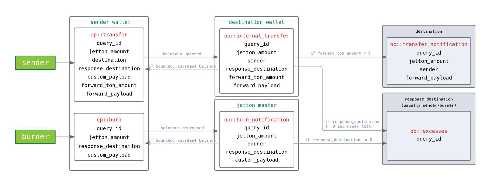
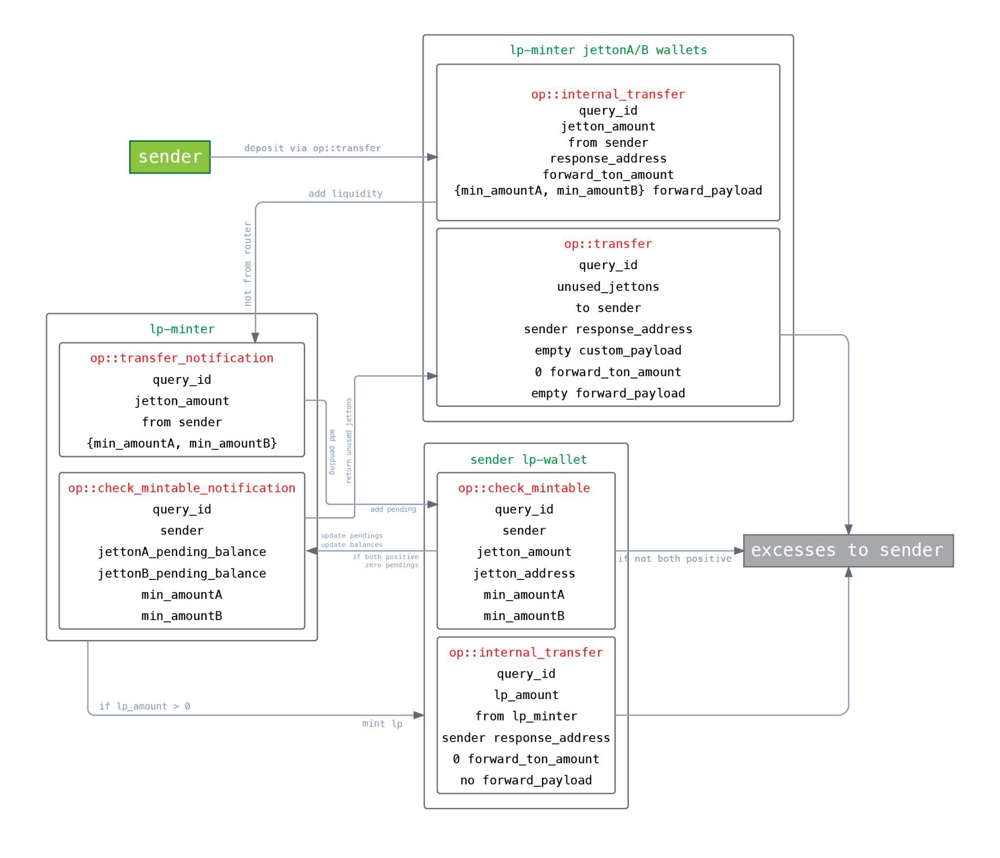
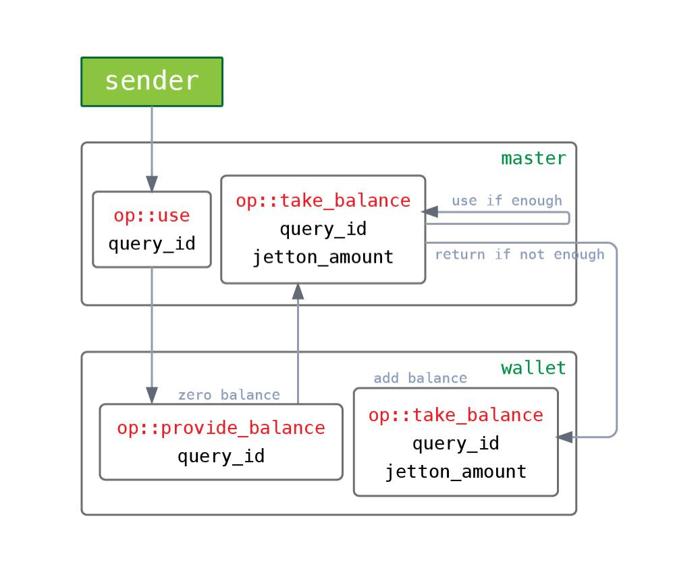

import ThemedImage from '@theme/ThemedImage';

# Secure Smart Contract Programming 

In this section, we'll look at a few of the most interesting features of the TON blockchain, and then walk through a list of best practices for developers programming smart contracts on FunC.

## Contract Sharding

When developing contracts for the EVM, you generally break up the project into several contracts for convenience. In some cases, it is possible to implement all the functionality in one contract, and even where contract splitting was necessary (for example, Liquidity Pairs in the Automated Market Maker) this did not lead to any special difficulties. Transactions are executed in their entirety: either everything works out, or everything reverts.

In TON, it is strongly recommended to avoid “unbounded data structures” and [split a single logical contract into small pieces](https://blog.ton.org/how-to-shard-your-ton-smart-contract-and-why-studying-the-anatomy-of-tons-jettons), each of which manages a small amount of data. The basic example is the implementation of TON Jettons. This is TON's version of Ethereum's ERC-20 token standard. Briefly, we have:


1. One `jetton-minter` that stores `total_supply`, `minter_address`, and a couple of refs: token description (metadata) and `jetton_wallet_code`.
1. And a lot of jetton-wallet, one for each owner of these jettons. Each such wallet stores only the owner's address, their balance, jetton-minter address, and a link to jetton_wallet_code.

This is necessary so that the transfer of Jettons occurs directly between wallets and does not affect any high-load addresses, which is fundamental for the parallel processing of transactions.

That is, get ready so that your contract turns into a "group of contracts", and they will actively interact with each other.

## Partial Execution of Transactions is Possible

A new unique property appears in the logic of your contract: partial execution of transactions.

For example, consider the message flow of a standard TON Jetton:



As follows from the diagram:
1. sender sends an `op::transfer` message to its wallet (`sender_wallet`);
1. `sender_wallet` reduces the token balance;
1. `sender_wallet` sends an `op::internal_transfer` message to the recipient's wallet (`destination_wallet`);
1. `destination_wallet` increases its token balance;
1. `destination_wallet` sends `op::transfer_notification` to its owner (`destination`);
1. `destination_wallet` returns excess gas with `op::excesses` message on `response_destination` (usually `sender`).

Note that if the `destination_wallet` was unable to process the `op::internal_transfer` message (an exception occurred or the gas ran out), then this part and subsequent steps will not be executed. But the first step (reducing the balance in `sender_wallet`) will be completed. The result is a partial execution of the transaction, an inconsistent state of the `Jetton` and in this case, the loss of money.

In the worst case scenario, all the tokens can be stolen in this way. Imagine that you first accrue bonuses to the user, and then send an `op::burn` message to their Jetton wallet, but you cannot guarantee that the `op::burn` will be processed successfully.

## TON Smart Contract Developer Must Control the Gas

In Solidity, gas is not much of a concern for contract developers. If the user provides too little gas, everything will be reverted as if nothing had happened (but the gas will not be returned). If they provide enough, the actual costs will automatically be calculated and deducted from their balance.

In TON, the situation is different:

1. If there is not enough gas, the transaction will be partially executed;
1. If there is too much gas, the excess must be returned. This is the developer’s responsibility;
1. If a “group of contracts” exchanges messages, then control and calculation must be carried out in each message.

TON cannot automatically calculate the gas. The complete execution of the transaction with all its consequences can take a long time, and by the end, the user may not have enough toncoins in their wallet. The carry-value principle is used again here.

## TON Smart Contract Developer Must Manage the Storage

A typical message handler in TON follows this approach:

```func
() handle_something(...) impure {
    (int total_supply, <a lot of vars>) = load_data();
    ... ;; do something, change data
    save_data(total_supply, <a lot of vars>);
}
```

Unfortunately, we are noticing a trend: `<a lot of vars>` is a real enumeration of all contract data fields. For example:

```func
(
    int total_supply, int swap_fee, int min_amount, int is_stopped, int user_count, int max_user_count, 
    slice admin_address, slice router_address, slice jettonA_address, slice jettonA_wallet_address, 
    int jettonA_balance, int jettonA_pending_balance, slice jettonB_address, slice jettonB_wallet_address, 
    int jettonB_balance, int jettonB_pending_balance, int mining_amount, int datetime_amount, int minable_time, 
    int half_life, int last_index, int last_mined, cell mining_rate_cell, cell user_info_dict, cell operation_gas, 
    cell content, cell lp_wallet_code
) = load_data();
```

This approach has a number of disadvantages.

First, if you decide to add another field, say `is_paused`, then you need to update the `load_data()/save_data()` statements throughout the contract. And this is not only labor-intensive, but it also leads to hard-to-catch errors.

In a recent CertiK audit, we noticed the developer mixed up two arguments in places, and wrote:

```func
save_data(total_supply, min_amount, swap_fee, ...)
```

Without an external audit performed by a team of experts, finding such a bug is very difficult. The function was rarely used, and both confused parameters usually had a value of zero. You really have to know what you’re looking for to pick up on an error like this.

Secondly, there is "namespace pollution". Let's explain what the problem is with another example from an audit. In the middle of the function, the input parameter read:

```func
int min_amount = in_msg_body~load_coins();
```

That is, there was a shadowing of the storage field by a local variable, and at the end of the function, this replaced value was stored in storage. The attacker had the opportunity to overwrite the state of the contract. The situation is aggravated by the fact that FunC allows the [redeclaration of variables](https://docs.ton.org/develop/func/statements#variable-declaration): “This is not a declaration, but just a compile-time insurance that min_amount has type int.”

And finally, parsing the entire storage and packing it back on every call to every function increases the gas cost.

## Tips

### 1. Always Draw Message Flow Diagrams

Even in a simple contract like a TON Jetton, there are already quite a few messages, senders, receivers, and pieces of data contained in messages. Now imagine how it looks when you’re developing something a little more complex, like a decentralized exchange (DEX) where the number of messages in one workflow can exceed ten.



At CertiK, we use the [DOT](https://en.wikipedia.org/wiki/DOT_(graph_description_language)) language to describe and update such diagrams during the course of the audit. Our auditors find that this helps them visualize and understand the complex interactions within and between contracts.

### 2. Avoid Fails and Catch Bounced Messages

Using the message flow, first define the entry point. This is the message that starts the cascade of messages in your group of contracts (“consequences”). It is here that everything needs to be checked (payload, gas supply, etc.) in order to minimize the possibility of failure in subsequent stages.

If you are not sure whether it will be possible to fulfill all your plans (for example, whether the user has enough tokens to complete the deal), it means that the message flow is probably built incorrectly.

In subsequent messages (consequences), all `throw_if()/throw_unless()` will play the role of asserts rather than actually checking something.

Many contracts also process bounced messages just in case.

For example, in TON Jetton, if the recipient's wallet cannot accept any tokens (it depends on the logic for receiving), then the sender's wallet will process the bounced message and return the tokens to its own balance.

```func
() on_bounce (slice in_msg_body) impure {
    in_msg_body~skip_bits(32);  ;;0xFFFFFFFF

    (int balance, slice owner_address, slice jetton_master_address, cell jetton_wallet_code) = load_data();

    int op = in_msg_body~load_op();

    throw_unless(error::unknown_op, (op == op::internal_transfer) | (op == op::burn_notification));

    int query_id = in_msg_body~load_query_id();
    int jetton_amount = in_msg_body~load_coins();

    balance += jetton_amount;
    save_data(balance, owner_address, jetton_master_address, jetton_wallet_code);
}
```

In general, we recommend processing bounced messages, however, they can’t be used as a means of full protection from failed message processing and incomplete execution.

It takes gas to send a bounced message and process it, and if there isn’t enough provided by the sender, then no bounced.

Secondly, TON does not provide for a chain of jumps. This means a bounced message can't be re-bounced. For example, if the second message is sent after the entry message, and the second one triggers the third one, then the entry contract will not be aware of the failure of processing the third message. Similarly, if the processing of the first sends the second and the third, then the failure of the second will not affect the processing of the third.

### 3. Expect a Man-in-the-Middle of the Message Flow

A message cascade can be processed over many blocks. Assume that while one message flow is running, an attacker can initiate a second one in parallel. That is, if a property was checked at the beginning (e.g. whether the user has enough tokens), do not assume that at the third stage in the same contract they will still satisfy this property.

### 4. Use a Carry-Value Pattern

It follows from the previous paragraph that messages between contracts must carry valuables.

In the same TON Jetton, this is demonstrated: `sender_wallet` subtracts the balance and sends it with an `op::internal_transfer` message to `destination_wallet`, and it, in turn, receives the balance with the message and adds it to its own balance (or bounces it back).

And here is an example of incorrect implementation. Why can't you find out your Jetton balance on-chain? Because such a question does not fit the pattern. By the time the response to the `op::get_balance` message reaches the requester, this balance could already have been spent by someone.

In this case, you can implement an alternative:


1. master sends a message `op::provide_balance` to the wallet;
1. wallet zeroes its balance and sends back `op::take_balance`;
1. master receives the money, decides if it has enough, and either uses it (debits something in return) or sends it back to wallet.

### 5. Return Value Instead of Rejecting

From the previous observation, it follows that your group of contracts will often receive not just a request, but a request along with a value. So you can't just refuse to execute the request (via `throw_unless()`), you have to send the Jettons back to the sender.

For example, a typical flow start (see TON Jetton message flow):

1. `sender` sends an `op::transfer` message via `sender_wallet` to `your_contract_wallet`, specifying `forward_ton_amount` and `forward_payload` for your contract;
1. `sender_wallet` sends an `op::internal_transfer` message to `your_contract_wallet`;
1. `your_contract_wallet` sends an `op::transfer_notification` message to `your_contract`, delivering `forward_ton_amount`, `forward_payload`, and the `sender_address` and `jetton_amount`;
1. And here in your contract in `handle_transfer_notification()` the flow begins.

There you need to figure out what kind of request it was, whether there is enough gas to complete it, and whether everything is correct in the payload. At this stage, you should not use `throw_if()/throw_unless()`, because then the Jettons will simply be lost, and the request will not be executed. It's worth using the try-catch statements [available starting from FunC v0.4.0](https://docs.ton.org/develop/func/statements#try-catch-statements).

If something does not meet the expectations of your contract, the Jettons must be returned.

We found an example of this vulnerable implementation in a recent audit.

```func
() handle_transfer_notification(...) impure {
...
    int jetton_amount = in_msg_body~load_coins();
    slice from_address = in_msg_body~load_msg_addr();
    slice from_jetton_address = in_msg_body~load_msg_addr();

    if (msg_value < gas_consumption) { ;; not enough gas provided
        if (equal_slices(from_jetton_address, jettonA_address)) {
            var msg = begin_cell()
                .store_uint(0x18, 6)
                .store_slice(jettonA_wallet_address)
                .store_coins(0)
                .store_uint(1, 1 + 4 + 4 + 64 + 32 + 1 + 1)
            ...
        }
    ...
}
```

As you can see, here the "return" is sent to `jettonA_wallet_address`, not `sender_address`. Since all decisions are made based on the analysis of `in_msg_body`, an attacker can forge a fake message and extract the money. Always send the return to `sender_address`.

If your contract accepts Jettons, it is impossible to know if it was indeed the expected Jetton that came, or just an `op::transfer_notification` from someone.

If your contract receives unexpected or unknown Jettons, they must also be returned.

### 6. Calculate Gas and Check msg_value

According to our message flow diagram, we can estimate the cost of each handler in each of the scenarios and insert a check for the sufficiency of msg_value.

You can’t just demand with a margin, say 1 TON (the gas_limit on mainnet as of the date of writing) because this gas must be divided among the “consequences”. Let's say your contract sends three messages, then you can only send 0.33 TON to each. This means that they should “demand” less. It’s important to calculate the gas requirements of your whole contract carefully.

Things get more complicated if, during development, your code starts sending more messages. Gas requirements need to be rechecked and updated.

### 7. Return Gas Excesses Carefully

If excess gas is not returned to the sender, the funds will accumulate in your contracts over time. In principle, nothing terrible, this is just suboptimal practice. You can add a function for raking out excesses, but popular contracts like TON Jetton still return to the sender with the message `op::excesses`.

TON has a useful mechanism: `SEND_MODE_CARRY_ALL_REMAINING_MESSAGE_VALUE = 64`. When using this mode in `send_raw_message()`, the rest of the gas will be forwarded further with the message (or back) to the new recipient. It is convenient if the message flow is linear: each message handler sends only one message. But there are cases when it is not recommended to use this mechanism:

1. If there are no other non-linear handlers in your contract. storage_fee is deducted from the balance of the contract, and not from the incoming gas. This means that over time, storage_fee can eat up the entire balance because everything that comes in has to go out;
1. If your contract emits events, i.e. sends a message to an external address. The cost of this action is deducted from the balance of the contract, and not from msg_value.
```func
() emit_log_simple (int event_id, int query_id) impure inline {
    var msg = begin_cell()
        .store_uint (12, 4)             ;; ext_out_msg_info$11 addr$00
        .store_uint (1, 2)              ;; addr_extern$01
        .store_uint (256, 9)            ;; len:(## 9)
        .store_uint(event_id, 256);     ;; external_address:(bits len)
        .store_uint(0, 64 + 32 + 1 + 1) ;; lt, at, init, body
        .store_query_id(query_id)
        .end_cell();
    
    send_raw_message(msg, SEND_MODE_REGULAR);
}
```
3. If your contract attaches value when sending messages or uses `SEND_MODE_PAY_FEES_SEPARETELY = 1`. These actions deduct from the balance of the contract, which means that returning unused is "working at a loss."

In the indicated cases, a manual approximate calculation of the surplus is used:

```func
int ton_balance_before_msg = my_ton_balance - msg_value;
int storage_fee = const::min_tons_for_storage - min(ton_balance_before_msg, const::min_tons_for_storage);
msg_value -= storage_fee + const::gas_consumption;

if(forward_ton_amount) {
    msg_value -= (forward_ton_amount + fwd_fee);
...
}

if (msg_value > 0) {    ;; there is still something to return

var msg = begin_cell()
    .store_uint(0x10, 6)
    .store_slice(response_address)
    .store_coins(msg_value)
...
}
```

Remember, if the value of the contract balance runs out, the transaction will be partially executed, and this cannot be allowed.

### 8. Use Nested Storage

We recommend the following storage organization approach:

```func
() handle_something(...) impure {
    (slice swap_data, cell liquidity_data, cell mining_data, cell discovery_data) = load_data();
    (int total_supply, int swap_fee, int min_amount, int is_stopped) = swap_data.parse_swap_data();
    …
    swap_data = pack_swap_data(total_supply + lp_amount, swap_fee, min_amount, is_stopped);
    save_data(swap_data, liquidity_data, mining_data, discovery_data);
}
```

Storage consists of blocks of related data. If a parameter is used in each function, for example, `is_paused`, then it is provided immediately by `load_data()`. If a parameter group is needed only in one scenario, then it does not need to be unpacked, it will not have to be packed, and it will not clog the namespace.

If the storage structure requires changes (usually adding a new field), then much fewer edits will have to be made.

Moreover, the approach can be repeated. If there are 30 storage fields in our contract, then initially you can get four groups, and then get a couple of variables and another subgroup from the first group. The main thing is not to overdo it.

Note that since a cell can store up to 1023 bits of data and up to 4 references, you will have to split the data into different cells anyway.

Hierarchical data is one of the main features of TON, let's use it for its intended purpose.

Global variables can be used, especially at the prototyping stage, where it is not entirely obvious what will be stored in the contract.

```func
global int var1;
global cell var2;
global slice var3;

() load_data() impure {
    var cs = get_data().begin_parse();
    var1 = cs~load_coins();
    var2 = cs~load_ref();
    var3 = cs~load_bits(512);
}

() save_data() impure {
    set_data(
        begin_cell()
            .store_coins(var1)
            .store_ref(var2)
            .store_bits(var3)
            .end_cell()
        );
}
```

That way, if you find out that you need another variable, you just add a new global variable and modify `load_data()` and `save_data()`. No changes throughout the contract are needed. However, since there is a limitation on the number of global variables (no more than 31), this pattern can be combined with the "nested storage" recommended above.

Global variables are also often more expensive than storing everything on the stack. This, however, depends on the number of stack permutations, so it is a good idea to prototype with globals and, when storage structure is completely clear, to switch to on stack variables with a "nested" pattern.

### 9. Use end_parse()

Use `end_parse()` wherever possible when reading data from storage and from the message payload. Since TON uses bit streams with variable data format, it’s helpful to ensure that you read as much as you write. This can save you an hour of debugging.


### 10. Use More Helper Functions, and Avoid Magic Numbers

This tip is not unique to FunC but it is especially relevant here. Write more wrappers, and helper functions, and declare more constants.

FunC initially has an incredible amount of magic numbers. If the developer does not make any effort to limit their usage, the result is something like this:

```func
var msg = begin_cell()
    .store_uint(0xc4ff, 17)         ;; 0 11000100 0xff
    .store_uint(config_addr, 256)
    .store_grams(1 << 30)           ;; ~1 gram of value
    .store_uint(0, 107)
    .store_uint(0x4e565354, 32)
    .store_uint(query_id, 64)
    .store_ref(vset);
    
send_raw_message(msg.end_cell(), 1);
```

This is code from a real project, and it scares off newbies.

Fortunately, in recent versions of FunC, a couple of standard declarations can make the code clearer and more expressive. For example:

```func
const int SEND_MODE_REGULAR = 0;
const int SEND_MODE_PAY_FEES_SEPARETELY = 1;
const int SEND_MODE_IGNORE_ERRORS = 2;
const int SEND_MODE_CARRY_ALL_REMAINING_MESSAGE_VALUE = 64;

builder store_msgbody_prefix_stateinit(builder b) inline {
    return b.store_uint(4 + 2 + 1, 1 + 4 + 4 + 64 + 32 + 1 + 1 + 1);
}

builder store_body_header(builder b, int op, int query_id) inline {
    return b.store_uint(op, 32).store_uint(query_id, 64);
}

() mint_tokens(slice to_address, cell jetton_wallet_code, int amount, cell master_msg) impure {
    cell state_init = calculate_jetton_wallet_state_init(to_address, my_address(), jetton_wallet_code);
    slice to_wallet_address = calculate_address_by_state_init(state_init);
    
    var msg = begin_cell()
        .store_msg_flags(BOUNCEABLE)
        .store_slice(to_wallet_address)
        .store_coins(amount)
        .store_msgbody_prefix_stateinit()
        .store_ref(state_init)
        .store_ref(master_msg);

    send_raw_message(msg.end_cell(), SEND_MODE_REGULAR);
}
```

## References

Originally written by CertiK

- [Original article](https://blog.ton.org/secure-smart-contract-programming-in-func)


