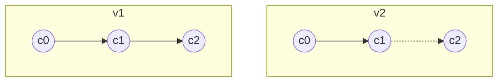
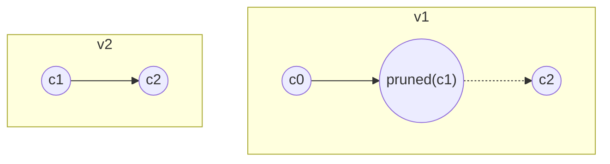
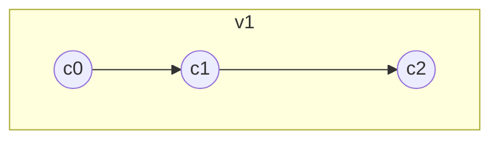

import Feedback from '@site/src/components/Feedback';

# Basic proof concepts

A **proof** is a tree-based structure that contains the necessary data and can be verified by a proof requester.
To prove something means to construct such a structure. The exact structure may differ depending on the use case. For example, suppose a proof is to be validated off-chain and requires multiple cell trees; the native TON approach is to construct a Bag of Cells (BoC) containing all the necessary cells. This is precisely what a lite server does when data is requested from the blockchain.

:::info
It is highly recommended to familiarize yourself with [Cells](/v3/documentation/data-formats/tlb/cell-boc) and [Exotic cells](/v3/documentation/data-formats/tlb/cell-boc) first. This article primarily covers situations where you want to verify a proof in a smart contract. However, the same techniques can be used to validate proofs off-chain.
:::

There are several key points to consider when proving anything on-chain.

- The only trusted information available in a smart contract is a few recent MasterChain blocks.
- Some data is stored directly within **blocks**.
- Additional information is maintained within the WorkChain **state**.
- **Blocks** serve as diffs that reflect changes to the **state** over time. Think of **blocks** as Git commits and the **state** as your repository.
- Latest TL-B schemas can be found in the [TON Monorepo](https://github.com/ton-blockchain/ton/blob/master/crypto/block/block.tlb). They may evolve, typically in backwards-compatible ways.


## More about blocks

We need to examine the block layout to determine what we can prove and how to do it.

Each block (ShardChain block, MasterChain block) has a unique block ID:
```tlb
block_id_ext$_ shard_id:ShardIdent seq_no:uint32
  root_hash:bits256 file_hash:bits256 = BlockIdExt;
```

- **ShardIdent** contains information about the WorkChain and the shard the block belongs to.
- **seq_no** is the sequence number of the current block.
- **root_hash** is the hash of the block data (block header).
- **file_hash** helps validators optimize processes; typically, you don’t need it.

A full block structure is as follows:
```tlb
block#11ef55aa global_id:int32
  info:^BlockInfo value_flow:^ValueFlow
  state_update:^(MERKLE_UPDATE ShardState)
  extra:^BlockExtra = Block;
```

The most relevant field here is **state_update**. This `MERKLE_UPDATE` cell stores the old and new hashes of the ShardChain state. Note that the MasterChain always consists of a single shard, so inspecting a MasterChain block reveals the MasterChain state hash.

Another relevant field is **extra**:

```tlb
block_extra in_msg_descr:^InMsgDescr
  out_msg_descr:^OutMsgDescr
  account_blocks:^ShardAccountBlocks
  rand_seed:bits256
  created_by:bits256
  custom:(Maybe ^McBlockExtra) = BlockExtra;
```

Inspecting a MasterChain block reveals the **McBlockExtra** field:

```tlb
masterchain_block_extra#cca5
  key_block:(## 1)
  shard_hashes:ShardHashes
  shard_fees:ShardFees
  ^[ prev_blk_signatures:(HashmapE 16 CryptoSignaturePair)
     recover_create_msg:(Maybe ^InMsg)
     mint_msg:(Maybe ^InMsg) ]
  config:key_block?ConfigParams
= McBlockExtra;
```

The **shard_hashes** field is essential, as it holds the latest known ShardChain blocks, which are critical for BaseChain proofs.

For detailed inspections, it is convenient to use the [official explorer](https://explorer.toncoin.org/).

## High-level overview of proofs

### Proving a transaction in MasterChain

To prove a transaction's existence in the **MasterChain**:

1. Obtain a trusted MasterChain block `root_hash` using TVM instructions (**PREVMCBLOCKS**, **PREVMCBLOCKS_100**, **PREVKEYBLOCKS**).
2. User provides a complete MasterChain block that should be validated against the trusted hash.
3. Parse the block to extract the transaction.

### Proving a transaction in BaseChain

For **BaseChain** transactions:

1. Follow *steps 1-2* above to get a trusted **MasterChain** block.
2. Extract the **shard_hashes** field from the MasterChain block.
3. User provides the full ShardChain block that should be validated against the trusted hash.
4. Parse the ShardChain block to find the transaction.

### Proving account states

Sometimes, data is not in block diffs but within the ShardState itself. To prove an account's state in the **BaseChain**:

1. Parse the ShardChain block’s `state_update` field. This exotic cell contains two ShardState hashes (before and after the block).
2. The user provides a ShardState that must be validated against the hash obtained in *step 1*.

:::info
You can only prove the state at block boundaries (not intermediate states).
:::
## Understanding pruned branch cells

Familiarize yourself with pruned branch cells and the concept of **hash0(cell)**.



*v1* is a regular cell tree; in *v2*, the cell *c1* becomes a pruned branch, removing its content and references. However, if you only need *c0*, there’s no practical difference, as `$hash_0(v1) == hash_0(v2)$`.

- **hash0(cell)** ignores pruned branches, returning the original tree’s hash.
- **reprHash(cell)** accounts for everything. Matching *reprHashes* ensures cell path equivalency.

:::note
Use `HASHCU` for reprHash and `CHASHI`/`CHASHIX` for different-level hashes.
:::

## Composing proofs

If you have two cell trees:



Approaches:

- Parse **v1** to get `$hash_0(c1) = x$` and verify the provided **v2**.
- Concatenate **v2** with **v1** to reconstruct the original tree.



:::info
- Trusted data hashes may be separated from cells (e.g., `PREVMCBLOCKS`).
- Replacing pruned cells with actual cells changes the `MERKLE_UPDATE` cell hash.
Always manually validate proofs against trusted hashes in these cases.
:::

## Real-world example

Let's consider a scenario where we want to prove that a particular account has a specific state. This is useful because having a state allows you to call a get-method on it or even emulate a transaction.
In this particular example, we want to prove the state of a JettonMaster and then call the `get_wallet_address` method on it. This way, even if a particular JettonMaster does not support [TEP-89](https://github.com/ton-blockchain/TEPs/blob/master/text/0089-jetton-wallet-discovery.md), it is still possible to obtain the wallet address for a specific account.

The [full example](https://github.com/tact-lang/dex/blob/main/sources/contracts/vaults/proofs/block-proof.tact) is too large for this article, but let's cover some key points.

This is an example of the proof composition technique described above. It is convenient because for `getRawAccountState`, the [LiteServer](/v3/documentation/infra/nodes/node-types) returns two items:
- the account state itself
- a BoC containing two proofs

The first is a ShardChain block proof, and the second is a shard state proof.

We will save gas and improve parsing convenience by concatenating the `AccountState` with the `ShardState` proof, which is a cell tree where all branches are pruned except for the path from the root to the `AccountState`. The `AccountState` itself is also pruned so that we will substitute the pruned `AccountState` with the actual one.

```ts
const accountStateAndProof = await client.liteServer.getRawAccountState(
            jettonMinterToProofStateFor,
            {
                target_block: blockToProofToStrId,
            },
        )

const proofs = Cell.fromBoc(Buffer.from(accountStateAndProof.proof, "hex"))

const scBlockProof = proofs[0]
const newShardStateProof = proofs[1]
const newShardState = newShardStateProof.refs[0]
const accountState = Cell.fromHex(accountStateAndProof.state)

const {path} = walk(newShardState, 0, [], null) // Find the deepest pruned branch cell
const patchedShardState = rebuild(newShardState, path, accountState) // And replace it with the actual account state
```

Another interesting point is how we access the hash of the last known `ShardBlock`.

```tact 
inline fun findShardInBinTree(root: Cell, address: Address, shardBitLen: Int): ShardDescr {
    let curCs = root.beginParse();
    // It's std address, but we parse it as VarAddress to get hash part as Slice, not as Int
    let accountId = myParseVarAddress(address.asSlice()).address;
    repeat (shardBitLen) {
        if (accountId.loadBool()) {
            // If the bit is 1, we go to the right child
            curCs = curCs.preloadIthRef(1).beginParse();
        } else {
            // If the bit is 0, we go to the left child
            curCs = curCs.preloadIthRef(0).beginParse();
        }
    }
    curCs.skipBits(1); // We need to skip 1 bit - leaf tag of the tree node
    return ShardDescr.fromSlice(curCs);
}

...

let mcBlockExtra = McBlockExtra.fromCell(blockHeader.extra.loadRef().beginParse().preloadIthRef(3));
// shardHashes is a hashmap (WorkChain -> ShardDescr)
// Therefore, we only need to retrieve the ShardDescr for WorkChain 0, as we are working in BaseChain.
// We can use a non-null assertion, as we already proved that it is a valid block and a valid MasterChain block must have a ShardDescr for WorkChain 0.
let binTreeWithShardDescr: Cell = mcBlockExtra.shardHashes.get(0)!!;
let shardDescr = findShardInBinTree(binTreeWithShardDescr, jettonMaster, shardBitLen);
```

```tlb
_ (HashmapE 32 ^(BinTree ShardDescr)) = ShardHashes;
```

A `BinTree` is a TL-B structure that operates straightforwardly. It stores a single bit to indicate whether the current cell is a leaf. If it is a leaf, it stores the **ShardDescr**. Otherwise, the cell holds two references: a left child and a right child.

Since a shard identifier is a binary prefix of an address, we can traverse the tree by following the path of bits in the address.


<Feedback />