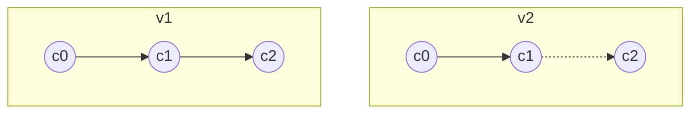
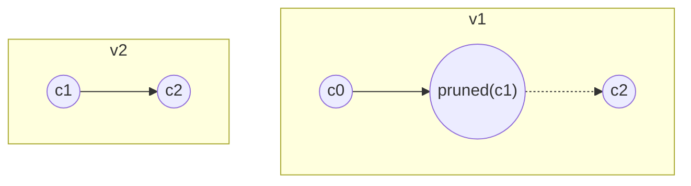
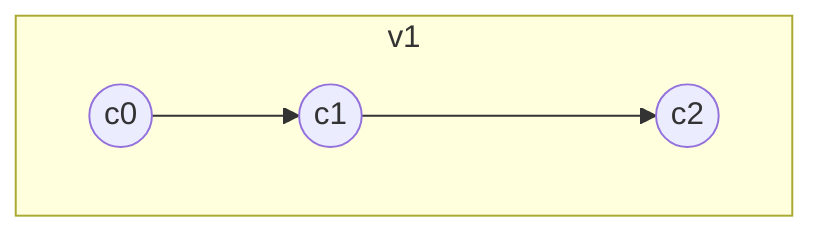

import Feedback from '@site/src/components/Feedback';

# Basic proofing concepts

Proof is a cell-based structure, containing the necessary data, that can be verified by proof requester.
To proof something means to construct such structure. In different cases exact structure may differ. For example, if proof will be validated offchain, and several cell trees are needed, the TON native way is to construct a BoC containing all needed cells. That is exactly what liteserver does, when one requests some data from blockchain.

:::info
It's highly recommended to familiarize yourself with [Cells](/v3/documentation/data-formats/tlb/cell-boc) and [Exotic cells](/v3/documentation/data-formats/tlb/cell-boc) first. This article mostly covers situations when you want to verify the proof in a smart contract. However, the same techniques can be used for validating proofs off-chain.
:::


TON Blockchain is very proof-friendly thanks to its Cell concept. Storing everything as a cell allows you to prove almost anything.

There are several key points to keep in mind when proving anything onchain.

- The only trusted information available in a smart contract is a few recent masterchain blocks.
- Some data is stored directly within **blocks**.
- Additional information is maintained within the workchain **state**.
- **Blocks** serve as diffs that reflect changes to the **state** over time. Think of **blocks** as Git commits and the **state** as your repository.
- Latest TLB schemas can be found in the [TON Monorepo](https://github.com/ton-blockchain/ton/blob/master/crypto/block/block.tlb). They may evolve, typically in backward-compatible ways.


## More about blocks

We need to take a look on block layout to understand what exactly we can proof and how to do that.

Each block (shardchain block, masterchain block) has a unique block ID:

```tlb
block_id_ext$_ shard_id:ShardIdent seq_no:uint32
  root_hash:bits256 file_hash:bits256 = BlockIdExt;
```

- **ShardIdent** contains information about the workchain and shard the block belongs to.
- **seq_no** is the sequence number of the current block.
- **root_hash** is the hash of the block data (block header).
- **file_hash** helps validators optimize processes; typically, you won’t need it.

A full block structure looks like this:

```tlb
block#11ef55aa global_id:int32
  info:^BlockInfo value_flow:^ValueFlow
  state_update:^(MERKLE_UPDATE ShardState)
  extra:^BlockExtra = Block;
```

The most relevant field here is **state_update**. This `MERKLE_UPDATE` cell stores old and new hashes of the shardchain state. Note that the masterchain always consists of a single shard, so inspecting a masterchain block reveals the masterchain state hash.

Another relevant field is **extra**:

```tlb
block_extra in_msg_descr:^InMsgDescr
  out_msg_descr:^OutMsgDescr
  account_blocks:^ShardAccountBlocks
  rand_seed:bits256
  created_by:bits256
  custom:(Maybe ^McBlockExtra) = BlockExtra;
```

Inspecting a masterchain block reveals the **McBlockExtra** field:

```tlb
masterchain_block_extra#cca5
  key_block:(## 1)
  shard_hashes:ShardHashes
  shard_fees:ShardFees
  ^[ prev_blk_signatures:(HashmapE 16 CryptoSignaturePair)
     recover_create_msg:(Maybe ^InMsg)
     mint_msg:(Maybe ^InMsg) ]
  config:key_block?ConfigParams
= McBlockExtra;
```

The **shard_hashes** field is important, it holds the latest known shardchain blocks, critical for basechain proofs.

For detailed inspections, it is convenient to use the [Official explorer](https://explorer.toncoin.org/).

---

## High-level overview of proofing

### Proving a transaction in masterchain

To prove a transaction existance in the **masterchain**:

1. Obtain a trusted masterchain block root_hash using TVM instructions (PREVMCBLOCKS, PREVMCBLOCKS_100, PREVKEYBLOCKS).
2. User provides a complete masterchain block that should be validated against the trusted hash.
3. Parse the block to extract the transaction.

### Proving a transaction in basechain

For **basechain** transactions:

1. Follow steps 1-2 above to get a trusted **masterchain** block.
2. Extract the **shard_hashes** field from the masterchain block.
3. User provides the full shardchain block that should be validated against the trusted hash.
4. Parse the shardchain block to find the transaction.

### Proving account states

Sometimes, data is not in block diffs but within the ShardState itself. To prove an account's state in the **basechain**:

1. Parse the shardchain block’s `state_update` field. This exotic cell contains two ShardState hashes (before and after the block).
2. User provides shardState that should be validated against hash you got on 1.

:::info
You can only prove the state at block boundaries (not intermediate states).
:::
## Understanding pruned branch cells

Familiarize yourself with pruned branch cells and the concept of **hash0(cell)**.



*v1* is a regular cell tree; in *v2*, the cell *c1* becomes a pruned branch, removing its content and references. However, if you only need *c0*, there’s no practical difference, as $hash_0(v1) == hash_0(v2)$.

- **hash0(cell)** ignores pruned branches, returning the original tree’s hash.
- **reprHash(cell)** accounts for everything. Matching reprHashes ensures cell path equivalency.

:::note
Use `HASHCU` for reprHash and `CHASHI`/`CHASHIX` for different-level hashes.
:::

---

## Composing proofs

If you have two cell trees:



Approaches:

- Parse **v1** to get $hash_0(c1) = x$ and verify provided **v2**.
- Concatenate **v2** to **v1** to reconstruct the original tree.



:::info
- Trusted data hashes may be separated from cells (e.g., PREVMCBLOCKS).
- Replacing pruned cells with actual cells changes MERKLE_UPDATE cell hash.
Always manually validate proofs against trusted hashes in these cases.
:::

## Real-world example

Let's consider we want to proof, that some account has some State. This is useful because having a state allows you to call get-method on it, or even emulate transaction.
In this exact example we want proof JettonMaster state and then call `get_wallet_address` method on it. So, if some particular JettonMaster does not support [TEP-89](https://github.com/ton-blockchain/TEPs/blob/master/text/0089-jetton-wallet-discovery.md) it is still possible to get wallet address for particular account.

The [whole example](https://github.com/tact-lang/dex/blob/main/sources/contracts/vaults/proofs/block-proof.tact) is too big for this article, but let's cover some interesting key points.

This is the example of compositing proofs technique described above. This is convenient as for `getRawAccountState` [LiteServer](/v3/documentation/infra/nodes/node-types) returns two things: AccountState itself + BoC containing two proofs. The first is ShardChain block proof, while the second is ShardState proof.

We will save some gas and improve parsing convenience by concatinating AccountState with ShardState proof, which is a cell tree where all branches are pruned except the path from the root to AccountState. AccountState itself is also pruned, so we will substitute pruned AccountState with real one.

```ts
const accountStateAndProof = await client.liteServer.getRawAccountState(
            jettonMinterToProofStateFor,
            {
                target_block: blockToProofToStrId,
            },
        )

const proofs = Cell.fromBoc(Buffer.from(accountStateAndProof.proof, "hex"))

const scBlockProof = proofs[0]
const newShardStateProof = proofs[1]
const newShardState = newShardStateProof.refs[0]
const accountState = Cell.fromHex(accountStateAndProof.state)

const {path} = walk(newShardState, 0, [], null) // Find the deepest pruned branch cell
const patchedShardState = rebuild(newShardState, path, accountState) // And replace it with the actual account state
```

Another interesting point is how we access the hash of the last known ShardBlock.

```tact 
inline fun findShardInBinTree(root: Cell, address: Address, shardBitLen: Int): ShardDescr {
    let curCs = root.beginParse();
    // It's std address, but we parse it as VarAddress to get hash part as Slice, not as Int
    let accountId = myParseVarAddress(address.asSlice()).address;
    repeat (shardBitLen) {
        if (accountId.loadBool()) {
            // If the bit is 1, we go to the right child
            curCs = curCs.preloadIthRef(1).beginParse();
        } else {
            // If the bit is 0, we go to the left child
            curCs = curCs.preloadIthRef(0).beginParse();
        }
    }
    curCs.skipBits(1); // We need to skip 1 bit - leaf tag of the tree node
    return ShardDescr.fromSlice(curCs);
}

...

let mcBlockExtra = McBlockExtra.fromCell(blockHeader.extra.loadRef().beginParse().preloadIthRef(3));
// shardHashes is a hashmap (workchain -> ShardDescr)
// so we just need to get ShardDescr for workchain 0, as we are working in basechain.
// We can use non-null assertion as we already proved that is is a valid block and
// valid mc block must have ShardDescr for workchain 0
let binTreeWithShardDescr: Cell = mcBlockExtra.shardHashes.get(0)!!;
let shardDescr = findShardInBinTree(binTreeWithShardDescr, jettonMaster, shardBitLen);
```

```tlb
_ (HashmapE 32 ^(BinTree ShardDescr)) = ShardHashes;
```

BinTree is a tlb structure that works in easy way. It stores one bit, indicating if the current cell is a leaf. And if it is a leaf, it stores the ShardDescr. Otherwise cell holds two refs - left and right child.

As shard identifier is a binary prefix of addresses, we can just go down the tree, following the path of bits in the address.


<Feedback />