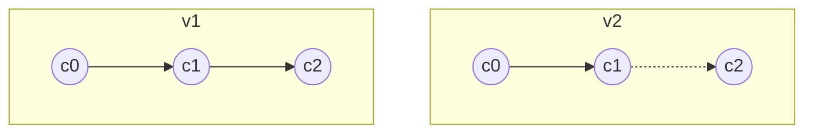
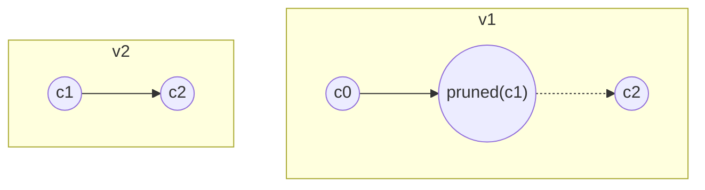
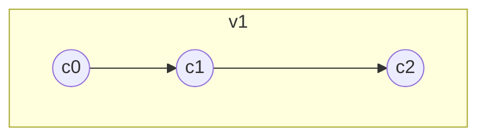

import Feedback from '@site/src/components/Feedback';

# Basic proofing concepts

TON Blockchain is very proof-friendly thanks to its Cell concept. Storing everything as a cell allows you to prove almost anything.

It's highly recommended to familiarize yourself with [Cells](./cell-boc.mdx) and [Exotic cells](./exotic-cells.mdx) first. This article mostly covers situations when you want to verify the proof in a smart contract. However, the same techniques can be used for validating proofs off-chain.

There are several key points to keep in mind when proving anything on the TON Blockchain:

- The only trusted information available in a smart contract is a few recent masterchain blocks.
- Crucial data is stored directly within **blocks**.
- Additional information is maintained within the workchain **state**.
- **Blocks** serve as diffs that reflect changes to the **state** over time. Think of **blocks** as Git commits and the **state** as your repository.
- Updated TLB schemas can be found in the [TON Monorepo](https://github.com/ton-blockchain/ton/blob/master/crypto/block/block.tlb). They may evolve, typically in backward-compatible ways.

---

## More about blocks

Each block (shardchain block, masterchain block) has a unique block ID:

```tlb
block_id_ext$_ shard_id:ShardIdent seq_no:uint32
  root_hash:bits256 file_hash:bits256 = BlockIdExt;
```

- **ShardIdent** contains information about the workchain and shard the block belongs to.
- **seq_no** is the sequence number of the current block.
- **root_hash** is the hash of the block data (block header).
- **file_hash** helps validators optimize processes; typically, you won’t need it.

---

## Block structure overview

A full block structure looks like this:

```tlb
block#11ef55aa global_id:int32
  info:^BlockInfo value_flow:^ValueFlow
  state_update:^(MERKLE_UPDATE ShardState)
  extra:^BlockExtra = Block;
```

The most relevant field here is **state_update**. This `MERKLE_UPDATE` cell stores old and new hashes of the shardchain state. Note that the masterchain always consists of a single shard, so inspecting a masterchain block reveals the masterchain state hash.

Another relevant field is **extra**:

```tlb
block_extra in_msg_descr:^InMsgDescr
  out_msg_descr:^OutMsgDescr
  account_blocks:^ShardAccountBlocks
  rand_seed:bits256
  created_by:bits256
  custom:(Maybe ^McBlockExtra) = BlockExtra;
```

Inspecting a masterchain block reveals the **McBlockExtra** field:

```tlb
masterchain_block_extra#cca5
  key_block:(## 1)
  shard_hashes:ShardHashes
  shard_fees:ShardFees
  ^[ prev_blk_signatures:(HashmapE 16 CryptoSignaturePair)
     recover_create_msg:(Maybe ^InMsg)
     mint_msg:(Maybe ^InMsg) ]
  config:key_block?ConfigParams
= McBlockExtra;
```

The **shard_hashes** field is important, it holds the latest known shardchain blocks, critical for basechain proofs.

For detailed inspections, it is convenient to use the [Official explorer](https://explorer.toncoin.org/).

---

## High-level overview of proofing

### Proving a transaction in masterchain

To prove a transaction existance in the **masterchain**:

1. Obtain a trusted masterchain block root_hash using TVM instructions (PREVMCBLOCKS, PREVMCBLOCKS_100, PREVKEYBLOCKS).
2. User provides a complete masterchain block that should be validated against the trusted hash.
3. Parse the block to extract the transaction.

### Proving a transaction in basechain

For **basechain** transactions:

1. Follow steps 1-2 above to get a trusted **masterchain** block.
2. Extract the **shard_hashes** field from the masterchain block.
3. User provides the full shardchain block that should be validated against the trusted hash.
4. Parse the shardchain block to find the transaction.

### Proving account states

Sometimes, data is not in block diffs but within the ShardState itself. To prove an account's state in the **basechain**:

- Parse the shardchain block’s `state_update` field. This exotic cell contains two ShardState hashes (before and after the block).
- You can only prove the state at block boundaries (not intermediate states).

---

## Understanding pruned branch cells

Familiarize yourself with pruned branch cells and the concept of **hash0(cell)**.



*v1* is a regular cell tree; in *v2*, the cell *c1* becomes a pruned branch, removing its content and references. However, if you only need *c0*, there’s no practical difference, as $hash_0(v1) == hash_0(v2)$.

- **hash0(cell)** ignores pruned branches, returning the original tree’s hash.
- **reprHash(cell)** accounts for everything. Matching reprHashes ensures cell path equivalency.

:::note
Use `HASHCU` for reprHash and `CHASHI`/`CHASHIX` for different-level hashes.
:::

---

## Composing proofs

If you have two cell trees:



Approaches:

- Parse **v1** to get $hash_0(c1) = x$ and verify provided **v2**.
- Concatenate **v2** to **v1** to reconstruct the original tree.



:::info
- Trusted data hashes may be separated from cells (e.g., PREVMCBLOCKS).
- Replacing pruned cells with actual cells changes MERKLE_UPDATE cell hash.
Always manually validate proofs against trusted hashes in these cases.
:::

<Feedback />