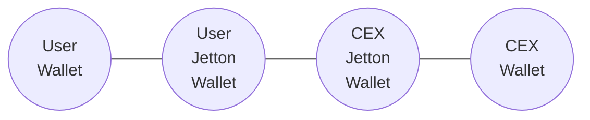

# USDT Processing

In this article, we describe how to ensure the correctness of handling Jetton Notify messages for USDT Jetton.

The only correct address for USDT Jetton Master is `EQCxE6mUtQJKFnGfaROTKOt1lZbDiiX1kCixRv7Nw2Id_sDs`

In this guide we use TypeScript with the following packages:
- [`@ton/ton`](https://www.npmjs.com/package/@ton/ton)
- [`@ton/core`](https://www.npmjs.com/package/@ton/core)


This is a typical trace of Jetton transfer that we intend to check.



## Validation flow

To check that the transfer is genuine, we need to do a bunch of checks.

:::danger
  Caching the results of these checks, or their intermediate results is dangerous. Jettons can dynamically change the Jetton Master address they report during their lifetime.
:::


0. Set up the client.
```ts
import { TonClient } from "@ton/ton";
import { Address, TupleItem, beginCell } from "@ton/core";

const client = new TonClient({
    endpoint: "https://toncenter.com/api/v2/jsonRPC",
});

const usdtJettonMasterAddress = Address.parse("EQCxE6mUtQJKFnGfaROTKOt1lZbDiiX1kCixRv7Nw2Id_sDs")
const cexJettonWallet = Address.parse("CEX Jetton Wallet")
const cexWallet = Address.parse("CEX Wallet")
```

1. Check the USDT Jetton Master's claim that it recognizes this Jetton Wallet.
```ts
const data = await client.runMethod(
  usdtJettonMasterAddress,
  "get_wallet_address",
  [{
    type: "slice",
    cell: beginCell().storeAddress(cexWallet).endCell(),
  }],
);
const jettonWalletAddress = data.stack.readAddress();
if (!jettonWalletAddress.equals(cexJettonWallet)) {
  throw new Error("Not a USDT received");
}
```

2. Check the Jetton Wallet's claim that it belongs to the USDT Jetton Master. Since we already know the USDT Jetton Master's address and know that it will pass this check, we can skip this step.

```ts
const runGetMethodRes = await client.runMethod(
  cexJettonWallet,
  "get_wallet_data",
);
const stack = runGetMethodRes.stack;
const _walletBalance = stack.readBigNumber(); // unused
const _jettonWalletOwner = stack.readAddress(); // unused
const jettonMasterAddress = stack.readAddress();

if (!jettonMasterAddress.equals(usdtJettonMasterAddress)) {
  throw new Error("Not a USDT received");
}
```


## Testing your validation flow

To check that the validation flow works, you can deploy test Jetton from this [repo](https://github.com/Shvandre/test-usdt-validation).
To deploy test Jetton you need to run the following commands:
```bash
git clone https://github.com/Shvandre/test-usdt-validation
cd test-usdt-validation
mv .env.example .env
```

Edit `.env` file with your credentials.

Then run:
```bash
npm install
npm run build
npm run deploy:base
```

Then, you can transfer this Jetton to check that it won't pass the validation flow.

To transfer minted jettons use [this script](https://github.com/Shvandre/test-usdt-validation/blob/main/src/scripts/transfer-jettons.ts)