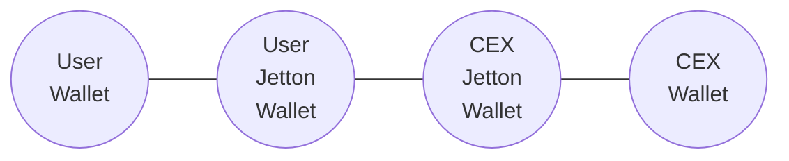

# USDT Processing

In this article, we describe how to ensure the correctness of handling Jetton Notify messages for USDT Jetton.

The only correct address for USDT Jetton Master is `EQCxE6mUtQJKFnGfaROTKOt1lZbDiiX1kCixRv7Nw2Id_sDs`

In this guide we use TypeScript with the following packages:
- [`@ton/ton`](https://www.npmjs.com/package/@ton/ton)
- [`@ton/core`](https://www.npmjs.com/package/@ton/core)


The process is as follows:



0. Set up the client.
```ts
import { TonClient } from "@ton/ton";
import { Address, TupleItem, beginCell } from "@ton/core";

const client = new TonClient({
    endpoint: "https://toncenter.com/api/v2/jsonRPC",
});

const usdtJettonMasterAddress = Address.parse("EQCxE6mUtQJKFnGfaROTKOt1lZbDiiX1kCixRv7Nw2Id_sDs")
const jettonWallet = Address.parse("Here goes the address that received Jetton Notify")
const depositAddress = Address.parse("Here goes the deposit address you receive payments to")
```

1. Check the USDT Jetton Master's claim that it recognizes this Jetton Wallet.
```ts
const data = await client.runMethod(
  usdtJettonMasterAddress,
  "get_wallet_address",
  [{
    type: "slice",
    cell: beginCell().storeAddress(depositAddress).endCell(),
  }],
);
const jettonWalletAddress = data.stack.readAddress();
if (!jettonWalletAddress.equals(jettonWallet)) {
  throw new Error("Not a USDT received");
}
```

2. Check the Jetton Wallet's claim that it belongs to the USDT Jetton Master.
```ts
const runGetMethodRes = await client.runMethod(
  jettonWallet,
  "get_wallet_data",
);
const stack = runGetMethodRes.stack;
const _walletBalance = stack.readBigNumber(); // unused
const _jettonWalletOwner = stack.readAddress(); // unused
const jettonMasterAddress = stack.readAddress();

if (!jettonMasterAddress.equals(usdtJettonMasterAddress)) {
  throw new Error("Not a USDT received");
}
```
